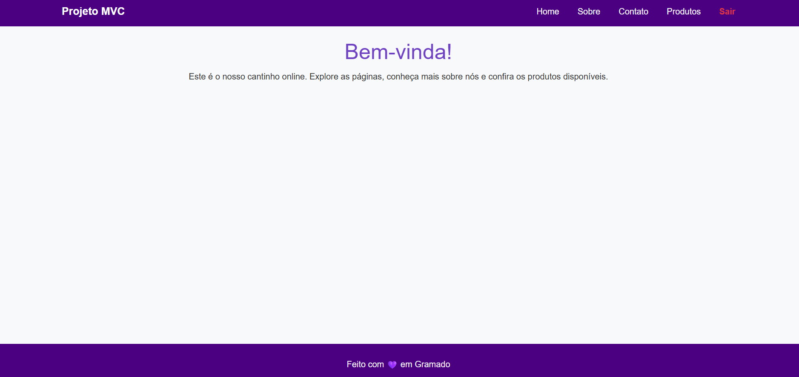
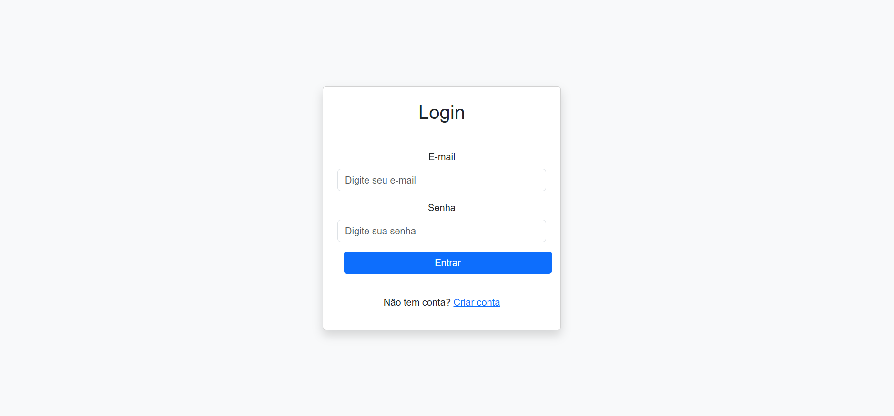
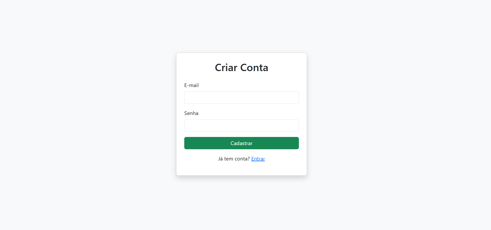
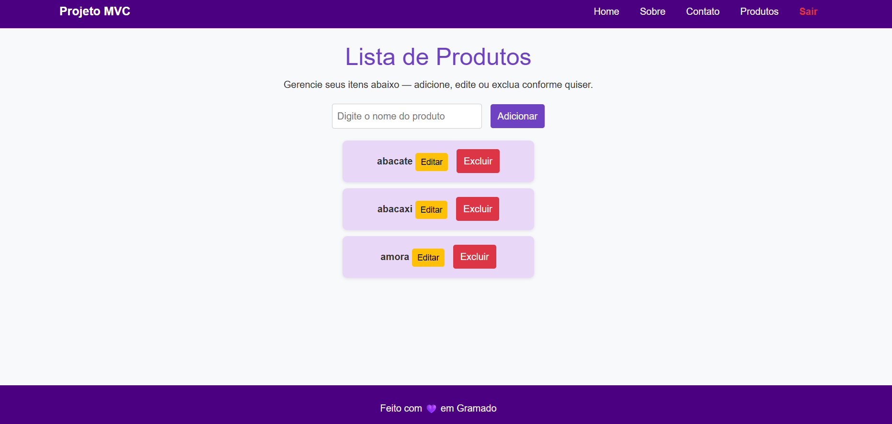
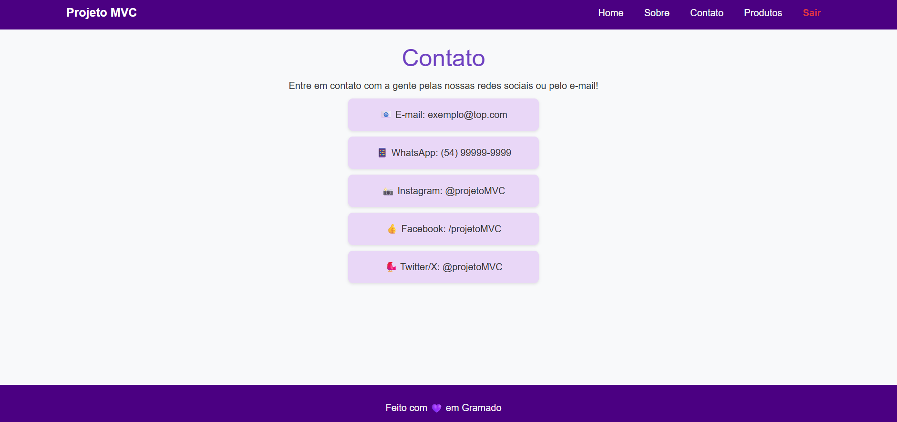
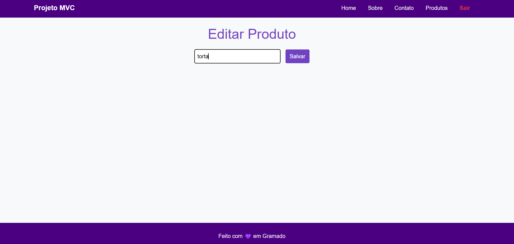

# Projeto MVC com Node.js

Aplicação web desenvolvida utilizando Node.js, Express e MongoDB seguindo o padrão MVC (Model-View-Controller).

O projeto possui autenticação de usuários, controle de sessão e gerenciamento de produtos, permitindo cadastrar, editar, listar e excluir registros.


## Tecnologias Utilizadas

- Node.js
- Express
- MongoDB
- Mongoose
- EJS
- Express Session
- Dotenv
- Nodemon
- JSDoc

## Funcionalidades

- Cadastro de usuários
- Login de usuários
- Controle de sessão
- Rotas protegidas por autenticação
- Cadastro de produtos
- Edição de produtos
- Exclusão de produtos
- Listagem de produtos
- Páginas institucionais: Home, Sobre e Contato

## Instalação e Execução

Clone o repositório:

```bash
git clone LINK_DO_REPOSITORIO
```

Acesse a pasta do projeto:

```bash
cd projeto-mvc18
```

Instale as dependências:

```bash
npm install
```

Execute o projeto em modo de desenvolvimento:

```bash
npm run dev
```

Ou execute em modo normal:

```bash
npm start
```

Acesse no navegador:

```bash
http://localhost:3000
```

## Variáveis de Ambiente

Crie um arquivo `.env` na raiz do projeto:

```env
MONGO_URI=sua_string_do_mongodb
PORT=3000
```

> Nunca envie senhas reais ou dados sensíveis para o GitHub.

## Estrutura do Projeto

```text
PROJETO-MVC18/
├── controllers/
│   ├── authController.js
│   └── produtoController.js
├── middlewares/
│   └── auth.js
├── models/
│   ├── produto.js
│   └── User.js
├── node_modules/
├── public/
│   └── css/
│       └── style.css
├── routes/
│   ├── authRoutes.js
│   └── produtoRoutes.js
├── screenshots/
│   ├── Home.png
│   ├── login.png
│   ├── criarConta.png
│   ├── listaProduto.png
│   ├── contato.png
│   └── editarProduto.png
├── views/
│   ├── partials/
│   │   ├── footer.ejs
│   │   └── header.ejs
│   ├── contato.ejs
│   ├── edit.ejs
│   ├── index.ejs
│   ├── login.ejs
│   ├── produtos.ejs
│   ├── register.ejs
│   └── sobre.ejs
├── .env
├── .gitignore
├── app.js
├── package-lock.json
├── package.json
└── README.md
```

## Documentação Interna

O projeto utiliza JSDoc para documentar os arquivos da camada Model e Controller.

Arquivos documentados:

- `models/produto.js`
- `controllers/produtoController.js`

A documentação auxilia na leitura do código e permite que o VS Code exiba informações sobre funções, parâmetros e retornos ao passar o mouse sobre os métodos.

## Imagens do Projeto

### Tela Inicial



### Tela de Login



### Tela de Cadastro



### Tela de Produtos



### Tela de Contato



### Tela de Edição de Produto



## Autor

Arianne Arruda

Projeto desenvolvido para a disciplina de Criação de Sites utilizando Node.js, Express, MongoDB e padrão MVC.